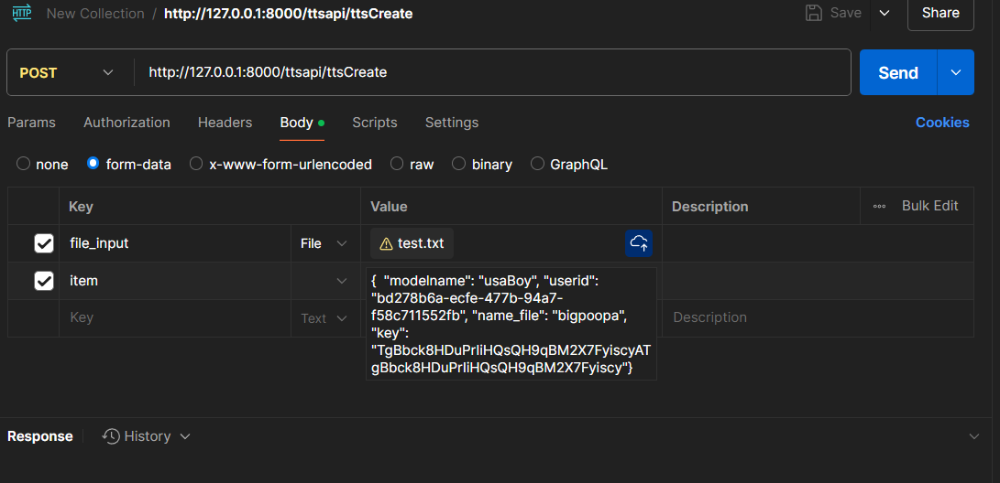

# Piper TTS API server built on top of Django Ninja.
## Adjusted to take log inputs.
## Has voice selection options built in.
## Sends WAV files to S3 bucket.
## Runs on windows, but you can swap out the piper enginer with a different version at https://github.com/rhasspy/piper/releases

- TTS engine used is Piper TTS https://github.com/rhasspy/piper.
- Voice models are built on data from multiple sources.
  -  https://github.com/dioco-group/jenny-tts-dataset
  -  https://datashare.ed.ac.uk/handle/10283/3270
  -  http://www.openslr.org/141/

- Demos at https://podgeaiaudio.github.io/
- App at https://www.podgeai.com/  (Backend is currently down due to unpaid AWS fees and dispute over free credits)

# Documentation

### Step 1: Create an AWS Account
If you don’t already have an AWS account, sign up at AWS.
Setting Up an AWS S3 Bucket - https://docs.aws.amazon.com/AmazonS3/latest/userguide/GetStartedWithS3.html

### Step 2: Create an S3 Bucket
Log in to the AWS Management Console.

Navigate to the S3 service.

Click Create bucket.

Fill in the following details:

Bucket name: Choose a unique name (e.g., my-tts-bucket).

Region: Select the region closest to you (e.g., us-east-1).

Leave other settings as default for now.

Click Create bucket.

### Step 3: Configure Bucket Permissions
Go to the Permissions tab of your bucket.

Under Block public access, uncheck Block all public access (if you want the files to be publicly accessible). Otherwise, keep it checked for private access.

Save changes.

### Step 4: Create an IAM User for S3 Access
Go to the IAM service in the AWS Console.

Click Users > Add user.

Enter a username (e.g., tts-api-user).

Under Access type, select Programmatic access.

Click Next: Permissions.

Attach the AmazonS3FullAccess policy to the user.

Click Next: Tags (optional) and then Next: Review.

Click Create user.

Save the Access Key ID and Secret Access Key (you’ll need these for the .env file).

### 5. Setting Up the .env File
Create a .env file in the root directory of your Django project. Add the following environment variables:

plaintext
Copy
## Piper TTS API Key
PIPER_KEY=make-up_your_own

## AWS S3 Credentials
AWS_ACCESS_KEY_ID=your_aws_access_key_id
AWS_ACCESS_SECRET_KEY_ID=your_aws_secret_access_key
AWS_STORAGE_BUCKET_NAME=your_bucket_name
AWS_S3_REGION_LOCATION=your_bucket_region
Replace the placeholders with your actual values:

your_piper_api_key: This is a security precaution built in as default and you can set it to whatever you want.

your_aws_access_key_id: The Access Key ID from the IAM user.

your_aws_secret_access_key: The Secret Access Key from the IAM user.

your_bucket_name: The name of your S3 bucket (e.g., my-tts-bucket).

your_bucket_region: The region of your S3 bucket (e.g., us-east-1).

### 4.  Setting up the environment.
There is two requirements files which you ca pick from; requirements.txt and requirements_noversions.txt
Try requirements.txt first but if it fails try requirements_noversions.txt

pip install -r requirements.txt

pip install -r requirements_noversions.txt

### 5. Running the project.
comes with two files for running; manage.py and runserver.py
manage.py is for testing and is the default django file (port:8000). - Run with command "python manage.py runserver"
runserver.py is for production and is done using waitress (port:8080).
Refer to stadnard Django Documentation if you wish to make changes to the settings.py file.

### 6. Testing the API
http://127.0.0.1:8000/ttsapi/ttsCreate
"file_input" : "path/to/txt_file.txt"
"item": {  "modelname": "usaBoy", "userid": "bd278b6a-ecfe-477b-94a7-f58c711552fb", "name_file": "bigpoopa", "key": "TgBbck8HDuPrIiHQsQH9qBM2X7FyiscyATgBbck8HDuPrIiHQsQH9qBM2X7Fyiscy"}

# Additional Notes
## Debugging Tips
If you encounter errors, check the Django server logs for detailed error messages.

Ensure your .env file is correctly formatted and placed in the root directory.

Verify that your AWS credentials have the correct permissions.

Security Best Practices
Never hardcode sensitive information (e.g., API keys, AWS credentials) in your code.

Use environment variables or a secrets manager.

Restrict IAM user permissions to only what is necessary (e.g., AmazonS3FullAccess can be replaced with a custom policy for stricter control).

